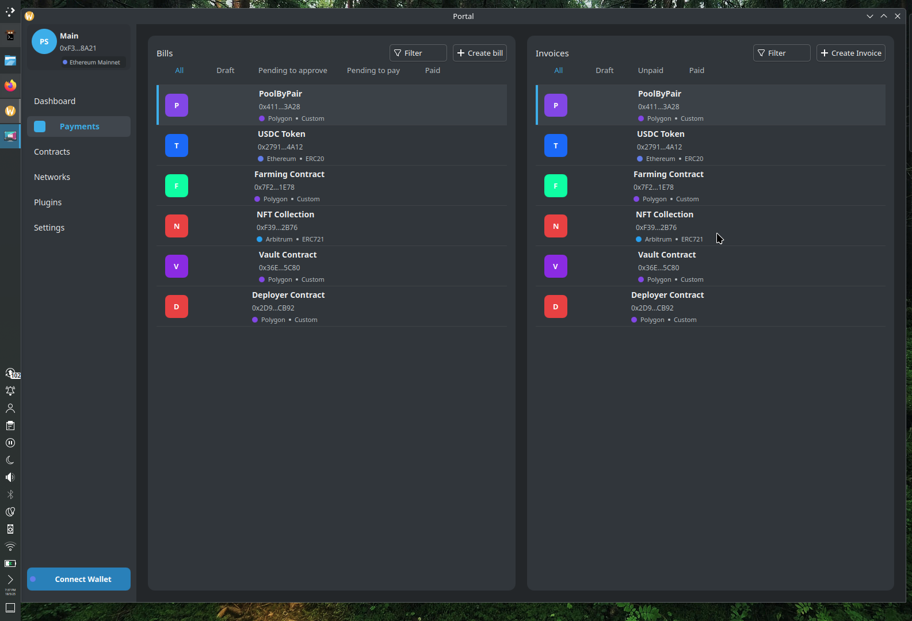

# Portal

A secure and convenient wallet

## Features

- [x] account abstraction 
    - create different type of wallets(like multisig)
    - protocol agnostic crosschain operations. Starts with [chainlink CCIP](https://docs.chain.link/ccip), then maybe layer0 or some bridge.
        I wanna be able to move my assets from one chain to another smoothly
    - create user operations or batch transactions together (e.g., approve and execute a swap in one go)
    - account management
        - [zkLogin sui](https://sui.io/zklogin) and [zkLogin eth](https://github.com/shield-labs/zklogin)
        - account recovery
        - flexible security rules(share your account security across trusted devices or individuals)
    - gas abstraction(pay gas with tokens, pay someone else's gas, or have someone else pay yours)
    - intent-like blockchain interaction maybe using AI agents(I need to think about this, the point is not over engineer everything with AI)

- [x] payments(scheduled/batch payments and crypto invoice for b2b)
    - bills: payment scheduled to be executed(like, a notification to remind me to send 1 USDT monthly)
    - invoices: payment scheduled to be received
    disclaimer:
        here I would like to include some sort payment distribution(for example, allow to send in 1 tx 1 eth to 10 accounts).
        Yes, the mock data is a token list

- [x] contract interaction(essentially ganache + abininja + postman for web3)
    - interact with contracts(including contracts in local networks, hardhat and foundry projects)
    - abi management(fetch ABI for verified contracts, provide ABI for unverified ones, store and delete ABIs)
    - allow to save and reproduce a workflow/user operation/sequence of transactions to play

- [x] Network management([chainlist](https://chainlist.org/))

## Features ?

- [ ] allow to interact with arbitrary plugins/protocols(anvil,dp2p,dex,aave)
- [ ] social( maybe some integration with contact software or CRM)
- [ ] finance management(maybe to keep track of cashflow)
